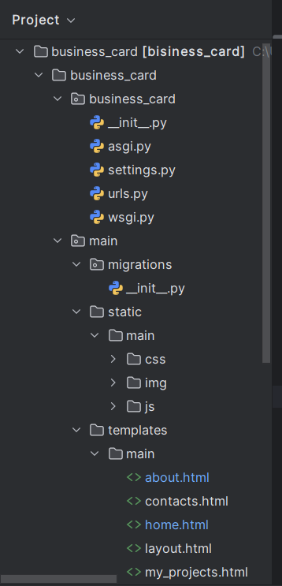
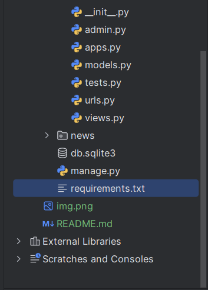
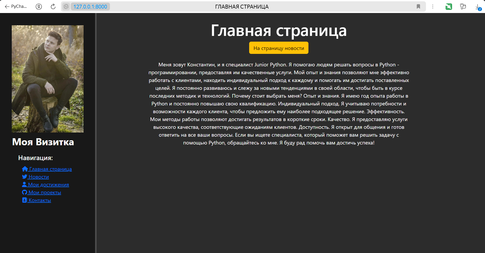
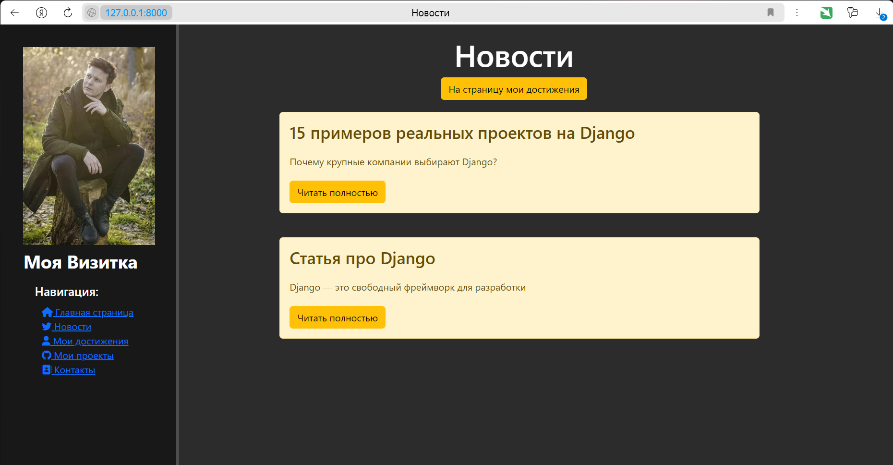
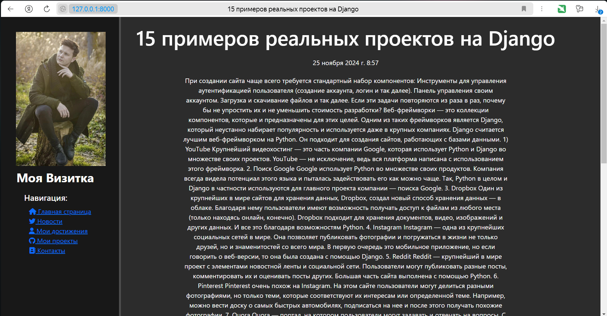
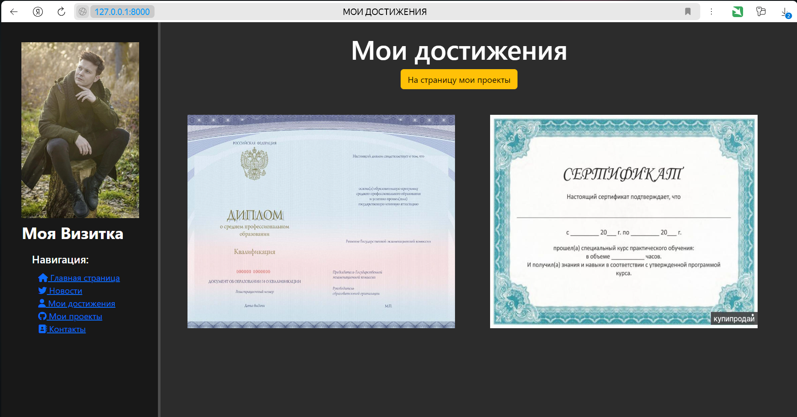
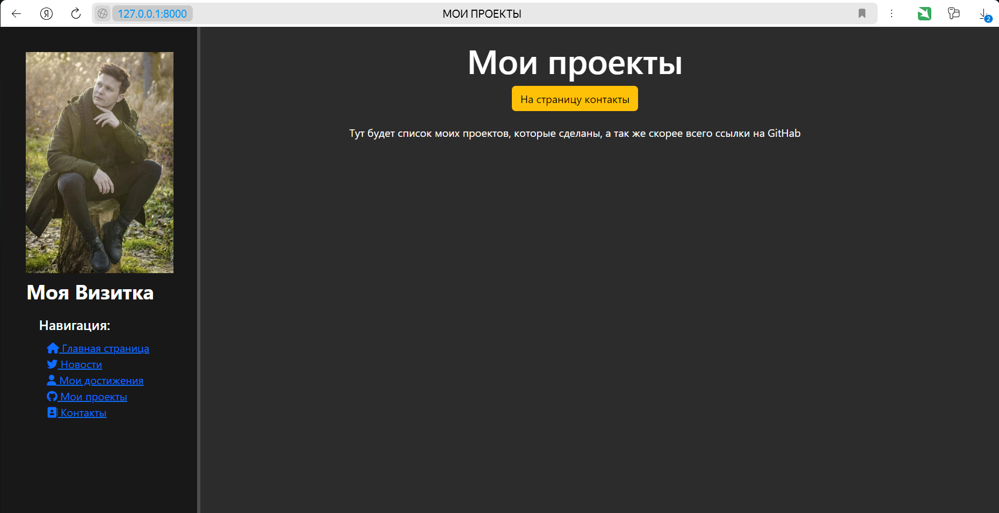
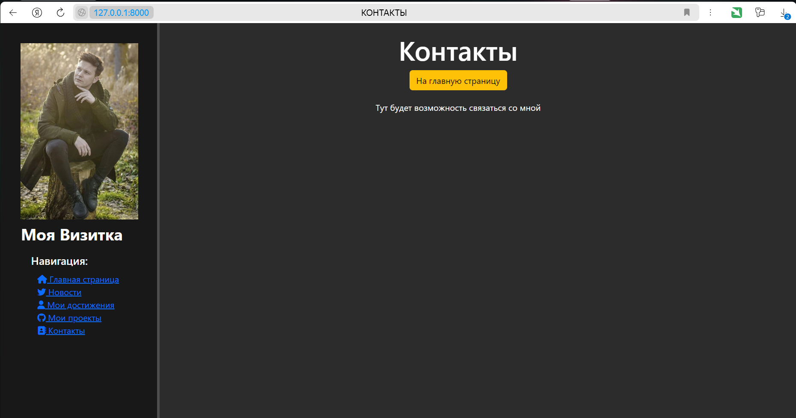
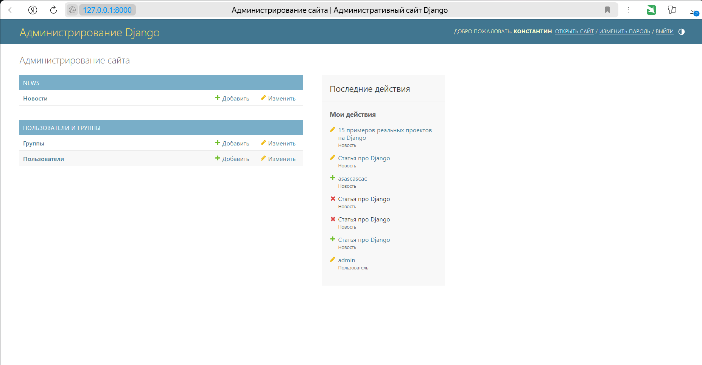

# **Название проекта:** **_МОЯ ВИЗИТКА._**

ФИО. Коковихин Константин Николаевич

### Создание сайта-визитки — это важный шаг в продвижении   своих услуг.

> **Цель:** Создание уникального и функционального сайта, 
> который будет привлекать клиентов и помогать в развитии, 
> рекламы и приема заявок на тех задания.

### **Используемые инструменты:**
> asgiref==3.8.1  
> Django==4.2.16  
> sqlparse==0.5.1  
> typing-extensions==4.12.2  
> tzdata==2024.2  

### Структура сайта (PyCharm):

### Примеры страниц в готовом проекте:

## Админ панель:

## Дальнейшие планы на проект:
1) Наполнение страниц (под себя);
2) Создание дополнительных страниц для связи;
3) Создание доп приложения с формой отправки техническое задание
4) Разработка возможности регистрации клиентов
5) Расширение админ-панели доп функциями
 
